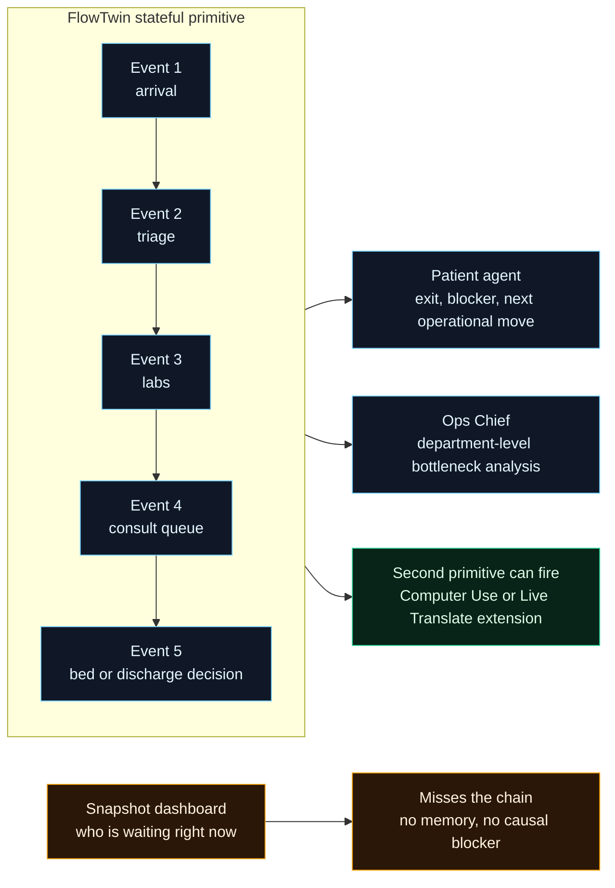
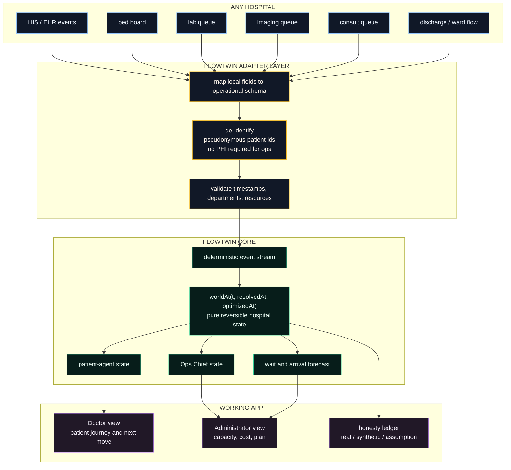
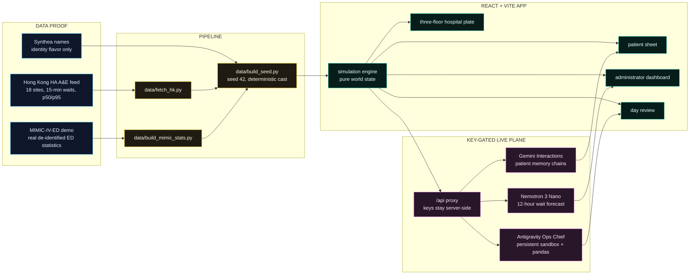
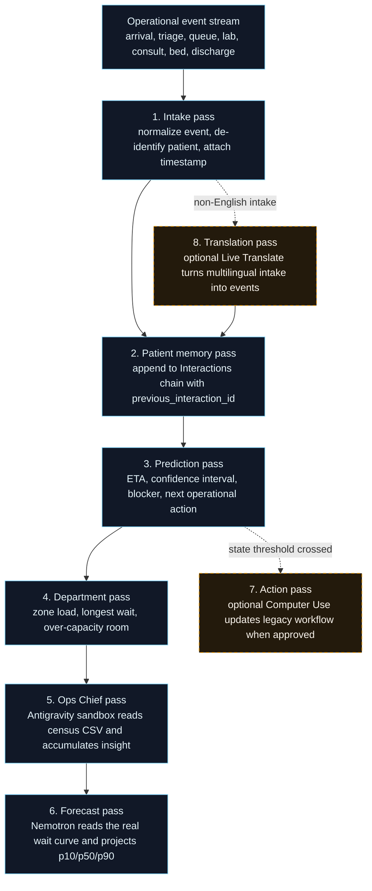
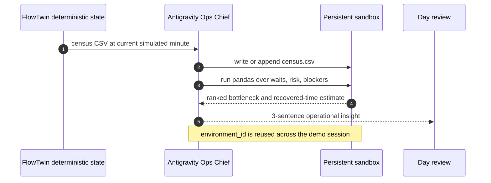
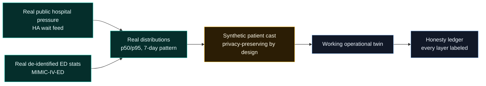
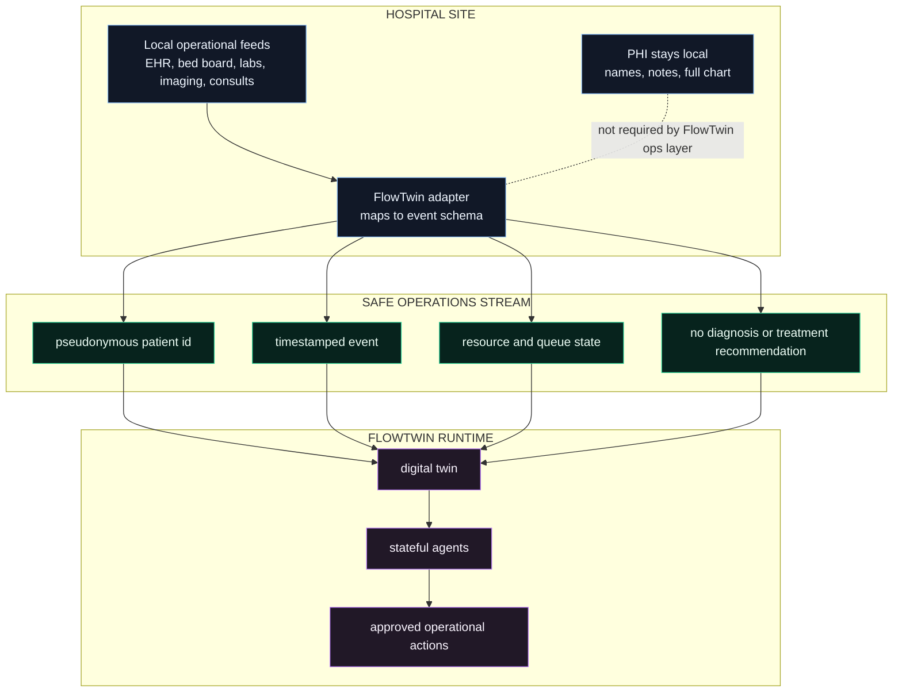
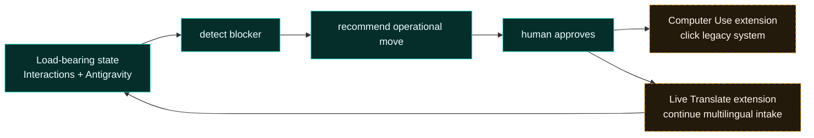
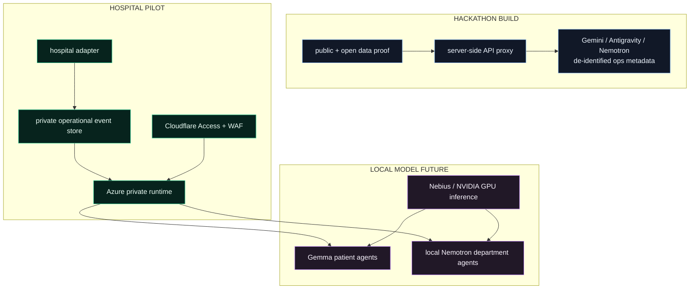

# FlowTwin

**A stateful operations twin for any hospital.**

FlowTwin turns hospital flow into a live agent system: every patient journey,
queue, bed, consult, lab delay, and discharge path is tracked over time, not
read from a frozen dashboard. The hackathon build proves the architecture on
**real, open, aggregated Hong Kong Hospital Authority A&E data**: 18 hospitals,
15-minute wait updates, p50/p95 waits by triage category, and a 7-day measured
daily pattern. Queen Mary Hospital is the proof site in this repo, but the
architecture is designed for any hospital that can expose operational events.

Presenter line:

> **Gemini runs the agents. Nemotron runs the hospital.**

In the shipped prototype, that means Gemini powers stateful patient-agent
memory and the Antigravity Ops Chief, while Nemotron forecasts the hospital wait
curve. In the target architecture, the same split becomes stronger: Google
handles cloud reasoning and action primitives; NVIDIA/open models run local
voice, department simulation, and safety gates inside the hospital boundary.

The key idea is simple:

> A hospital cannot be optimized from a snapshot. FlowTwin has to remember the
> whole journey.

This is not a clinical decision tool. It does not diagnose, prescribe, or rank
medical care. It is an operations layer for **time, beds, queues, handoffs, and
next operational actions**. Care stays with clinicians.

**See it:** run the app, scrub the hospital day, open a patient sheet, trigger a
delay, switch to Administrator view, and run the day review.

```bash
cd frontend
npm install
npm run dev
# http://localhost:5173
```

Production build:

```bash
cd frontend
npm run build
```

Live deploy from the original build notes:
<https://divine-roch-grounded-bf796e9a.koyeb.app/>

---

## Table of Contents

- [Why FlowTwin](#why-flowtwin)
- [Statement Four Fit](#statement-four-fit)
- [What Is Built](#what-is-built)
- [Presenter Walkthrough](#presenter-walkthrough)
- [General Architecture](#general-architecture)
- [The Agent Passes](#the-agent-passes)
- [Why Each Primitive Exists](#why-each-primitive-exists)
- [What Is Real](#what-is-real)
- [Any Hospital Integration](#any-hospital-integration)
- [Technology Stack](#technology-stack)
- [Partner Track Strategy](#partner-track-strategy)
- [Sovereignty and Gemma](#sovereignty-and-gemma)
- [Project Structure](#project-structure)
- [Getting Started](#getting-started)
- [Configuration](#configuration)
- [Demo Script](#demo-script)
- [Testing](#testing)
- [Roadmap](#roadmap)

---

## Why FlowTwin

Hospitals do not fail because a dashboard forgot to show a queue. They fail
because a patient's state changes across many disconnected moments:

- arrival and triage;
- bloodwork and imaging;
- consult requests;
- ward bed availability;
- discharge paperwork;
- queue pressure at the department level;
- handoff timing between teams.

A screenshot can show that a patient is waiting. It cannot explain **why they
are still waiting, what already happened, which queue is now the blocker, what
will happen if nothing changes, and which one operational move returns the most
capacity**.

FlowTwin makes that chain visible. The app presents a hospital as a working
floor plan, a time scrubber, patient-agent sheets, a Doctor view, an
Administrator view, and a day-review overlay. Each surface is backed by a
deterministic replay engine, so the same minute always produces the same
hospital state.

### The long-term product

FlowTwin is a hospital operations layer that can sit above any existing HIS,
EHR, bed board, lab queue, or ED dashboard:

| Hospital problem | FlowTwin layer |
|---|---|
| Staff see the current queue but not the journey that created it | Stateful patient-agent memory |
| Operations teams see averages but not the next local bottleneck | Department and floor load modeling |
| Discharge and bed delays hide inside separate systems | Cross-system operational event stream |
| Hospital data cannot leave the hospital freely | De-identified metadata path, local model roadmap |
| Every site has different workflows | Adapter layer maps local events into one state schema |

---

## Statement Four Fit

Google DeepMind Statement Four asks for an agent that cannot get away with a
snapshot. FlowTwin is built exactly around that constraint.

### The load-bearing primitive

The primitive is **persistent operational state**:

- patient-level state is held across turns with Gemini Interactions chains
  (`previous_interaction_id`);
- hospital-level analysis is held across runs with the Antigravity Ops Chief
  (`environment_id`);
- the deterministic twin keeps a reversible timeline so the app can scrub
  through the same hospital day without desyncing.

Remove that state and FlowTwin becomes a static dashboard. The app would still
show where a patient is, but it could not explain how the patient got there,
why the prediction moved, or why an operational action is justified.



### Why the second primitive matters

The strongest version of the product is a chain:

1. **Interactions API / Antigravity holds state.**
   The patient journey and hospital day continue across many events.
2. **A threshold is crossed.**
   A patient becomes blocked, a consult queue exceeds capacity, or a bed delay
   starts propagating.
3. **A second primitive fires because state exists.**
   - Gemini Computer Use can update a legacy bed board or EHR action screen.
   - Live Translate can turn multilingual intake into the same patient state.
   - Antigravity can keep analyzing the day as the event log grows.

This repo ships the deterministic twin plus the key-gated live plane:
**Gemini Interactions patient chains, Antigravity Ops Chief, and Nemotron
forecasting**. Computer Use, Live Translate, PersonaPlex voice, and full local
Gemma/Nemotron deployment are described as production extensions, not claimed as
finished code.

---

## What Is Built

### Shipped in this repo

| Surface | What it does | Status |
|---|---|---|
| Doctor view | Three-floor hospital plate, patient agents, floor switching, building view, zoom, journey traces | Built |
| Patient sheet | Flow, Predictions, Intake and Signals tabs with ETA, blocker, CI, resources, provenance | Built |
| Demo beats | Meet patient, lab delay, consult overload, resolve, day review | Built |
| Administrator view | Real network table, real daily wait pattern, load by floor, reallocation play, cost assumptions | Built |
| Time scrubber | Replays the hospital day and history against one deterministic state engine | Built |
| Honesty ledger | Field-by-field real vs synthetic vs assumption vs live-model labeling | Built |
| Gemini patient agent | Stateful Interactions chain per patient when `FLOWTWIN_GEMINI_KEY` is configured | Built |
| Antigravity Ops Chief | Persistent sandbox analyzing census CSV with pandas when Gemini key is configured | Built |
| Nemotron forecast | `nvidia/nemotron-3-nano-30b-a3b` zero-shot forecast over real 48-hour wait series | Built |
| TFT trained forecast | Temporal Fusion Transformer (NVIDIA TSPP reference model) trained on 60 days × 18 sites of the real feed, next-24 h p10/p50/p90 with a held-out backtest | Built |
| Gemma patient voice | `gemma-4-31b-it` translates a Cantonese patient self-report and summarizes it for the intake desk (Intake tab), communication-only | Built |
| Server-side key proxy | Vite dev proxy and nginx deploy proxy keep Gemini/NVIDIA keys out of the client | Built |

### On paper or roadmap

| Extension | Why it belongs | Status |
|---|---|---|
| Gemini Computer Use into a legacy EHR | The action primitive that fires after state detects a bottleneck | Planned in `PLAN.md` |
| Live Translate intake | Multilingual intake events append into the same patient state | Planned in `PLAN.md` |
| PersonaPlex voice | Talk to a patient persona generated from live operational state | Planned in `PLAN.md` |
| NemoGuard topic/safety gate | Enforce "operations only, never medical advice" at model boundary | Planned in `PLAN.md` |
| Nemotron Parse | OCR paper ambulance or handoff forms into structured intake events | Planned in `PLAN.md` |
| Local Gemma patient agents | Run stateful reasoning inside the hospital boundary | Roadmap |
| Local Nemotron department agents | Low-cost on-prem department simulation and forecasting | Roadmap |
| Cloudflare protected production edge | WAF, Zero Trust, rate limiting, app access control | Deployment path |
| Azure/Nebius private GPU deployment | Hospital-specific tuning and inference without exporting PHI | Deployment path |

---

## Presenter Walkthrough

The app's guided story uses one visible patient journey to explain the general
hospital architecture. The screen label is Sarah M., but the workflow is the
same for any patient in any hospital adapter.

| Time | State | What changes |
|---|---|---|
| 11:00 | Baseline | 58F chest-pain pathway, cardiology consult queued, predicted exit 14:20 |
| 12:30 | Lab delay | Troponin re-run queues in chemistry, predicted exit slides to 15:05 |
| 14:00 | Consult overload | The real afternoon climb opens; cardiology consult queue reaches 4/3, risk turns red, predicted exit slides to 16:50 |
| Resolve | Operational move | Move to observation bed O-6 and escalate consult coverage, predicted exit recovers to 16:05 |

Important distinction for judges:

- **Built today:** the Resolve button updates the FlowTwin deterministic twin,
  moves the patient to the observation ward, and changes the projected outcome.
- **Target action primitive:** Gemini Computer Use would execute that approved
  move in a legacy EHR or bed board such as the planned MediTrack Classic mock.

---

## General Architecture

The hackathon proof uses Queen Mary Hospital because Hong Kong publishes a
high-quality open A&E feed. The product architecture is hospital-agnostic:
replace the input adapters and the same event schema, agent passes, and views
work for another site.



### The one-picture build



---

## The Agent Passes

FlowTwin is easier to understand as a sequence of passes over the same
operational event stream. Each pass has a narrow job and writes back to the
same state model.



### Patient-agent pass

Each patient can have a stateful chain. The app seeds the chain with the
patient journey so far, then appends demo beats as events. The returned JSON is
compact and operational:

```json
{
  "predicted_exit": "16:05",
  "delay_risk": "elevated",
  "blocker": "cardiology_queue",
  "next_action": {
    "title": "Move to the obs ward and escalate consult",
    "explanation": "Operational bed-and-queue move only.",
    "impact_min": 45
  },
  "agent_note": "The recommendation references the accumulated journey, not just the latest event."
}
```

### Ops Chief pass

The Ops Chief gets a census CSV, keeps a persistent Antigravity environment,
runs Python/pandas, and returns a plain-language operational insight. The key
point is continuity: the environment can survive across snapshots, so the
agent is not re-learning the hospital day from scratch each time.



### Forecast pass

Nemotron 3 Nano reads the real trailing 48-hour cat-4/5 wait curve and returns
the next 12 hours as p10/p50/p90. It is labeled as a zero-shot reasoning
forecast because no hosted NVIDIA time-series foundation model is used here.

### TFT trained-forecast pass

Alongside the zero-shot Nemotron read, the Administrator view carries a second,
purpose-trained forecaster: a **Temporal Fusion Transformer** — the reference
model of [NVIDIA's Time Series Prediction Platform (TSPP)](https://catalog.ngc.nvidia.com/orgs/nvidia/resources/nvidia_tspp_notebooks).

In plain terms: instead of asking an LLM to eyeball the wait curve, we trained
a small dedicated time-series model on **60 days of the real published feed
across all 18 Hong Kong A&E sites** and it forecasts the **next 24 hours** of
cat-4/5 median waits, per hospital, with p10/p50/p90 uncertainty bands.

Two things make it honest rather than decorative:

- **A real backtest, not a claim.** The last 24 hours are held out and never
  seen in training. The card shows the model's measured mean absolute error on
  that window next to a same-hour-yesterday (seasonal-naive) baseline — in the
  committed run, TFT ±55 min vs naive ±72 min averaged across all 18 sites.
- **No GPU needed at demo time.** Training happens offline
  (`data/tft/build_dataset.py` pulls the history, `data/tft/train_tft.py`
  trains and backtests); the app reads only the committed
  `data/seed/tft_forecast.json`, so the card always renders.

The card is labeled "TFT — reference model of NVIDIA's TSPP", not "TSPP"
itself, because it runs the same architecture via `pytorch-forecasting` on CPU
rather than the TSPP GPU container. The dataset CSV is already TSPP-shaped, so
the full container + Triton serving path is a drop-in upgrade — see
`data/tft/README.md`.

---

## Why Each Primitive Exists

FlowTwin's primitives are not decorative. Each one maps to a hospital operations
failure mode.

| Primitive | Operational reason |
|---|---|
| Stateful Interactions | Patient flow is cumulative. You cannot predict remaining stay or spot avoidable delay without the history of what already happened. |
| Antigravity Ops Chief | Individual patient agents see one journey. The Ops Chief analyzes the whole hospital log to find macro patterns, bottlenecks, and shift-level actions. |
| Gemini Computer Use | Hospitals will not replace Epic, Cerner, or local bed-board software overnight. Computer Use is the action bridge after a human approves the operational move. |
| Live Translate | Intake often crosses languages. Translation should append facts into the same stateful patient chain instead of creating a separate transcript artifact. |
| Nemotron forecast | The hospital needs forward pressure estimates, not only current load. The prototype uses Nemotron 3 Nano over the real wait curve. |
| NemoGuard | Healthcare agents must stay inside the logistics boundary. Topic and safety gates prevent operational assistants from drifting into diagnosis or treatment. |
| PersonaPlex / local voice | Voice is sensitive and latency-sensitive. Local voice keeps patient conversations inside the hospital firewall. |
| Gemma roadmap | As local open models improve, the patient-agent layer can run fully in-hospital while preserving the same FlowTwin event schema. |

---

## What Is Real

The app is deliberately explicit about provenance. The public Hong Kong feed is
aggregated and anonymous by design. It publishes hospital-level waits, not
patient-level records. FlowTwin uses that as a feature: the hospital pressure
is real, while individual personas are synthetic and labeled.

| Layer | Source | Status |
|---|---|---|
| Hospital identity, cluster, district | Hong Kong Hospital Authority | Real |
| A&E wait times by triage category | HA open feed, updated every 15 minutes | Real, live, aggregated |
| 48-hour and 7-day wait pattern | data.gov.hk historical archive | Real, measured |
| Arrival shape, LOS tails, acuity/vitals distributions | MIMIC-IV-ED demo, n=222 | Real de-identified statistics |
| Patient names, ages, station-level rooms, scripted beats | Synthea plus deterministic generation | Synthetic, labeled |
| Individual waits | Drawn through the hospital's real p50/p95 at arrival snapshot | Synthetic individual, real distribution |
| Money and recoverable minutes | HK$400/bed-hour and per-line assumptions | Stated assumption |
| Live Gemini / Antigravity / Nemotron outputs | Server-side key-gated model calls | Live model call when keys are present |
| Next-24 h TFT forecast + backtest MAE | Temporal Fusion Transformer trained offline on 60 days of the real feed, last 24 h held out | Trained model, measured backtest |



Current committed seed facts:

- proof hospital: Queen Mary Hospital, Hong Kong West, Pok Fu Lam;
- live feed anchor in the seed: `2026-07-05T02:45` HKT;
- live feed snapshot: cat-3 p50 27 min, cat-4/5 p50 270 min;
- today cast: 64 operational journeys;
- history log: 472 journeys;
- recurring pattern: cat-4/5 median wait climbs from 128 min at 08:00 to
  283 min at 17:00 across the 7-day archive;
- optimizer plan: HK$54.5k/day under stated assumptions, labeled line by line.

Dataset correction for older pitch notes: an earlier plan used Synthea ED
encounters and a Hugging Face hospital-admissions benchmark as the main data
backbone. The current repo pivoted to Hong Kong HA live/open wait data plus
MIMIC-IV-ED statistics. Synthea remains only as synthetic identity flavor.

---

## Any Hospital Integration

FlowTwin needs operational events, not PHI. A production adapter can ingest
different systems depending on the hospital:

| Input | Minimum fields |
|---|---|
| ED arrival feed | pseudonymous patient id, arrival time, mode, triage category |
| Bed board | patient id, bed/area, assigned time, released time |
| Labs | order time, result time, queue status, department |
| Imaging | order time, scan time, queue status, modality |
| Consult queue | specialty, request time, completed time, escalation state |
| Ward/discharge | admit request, bed ready, transfer, discharge complete |

The adapter maps local names into FlowTwin's operational schema. Hospitals can
keep names, clinical notes, and raw PHI inside their own boundary. FlowTwin can
operate on pseudonymous IDs and timestamps because the task is operational:
time, queues, rooms, and handoffs.



---

## Technology Stack

### Prototype stack that runs today

| Layer | Technology | Role |
|---|---|---|
| UI | React 19 and TypeScript | Type-safe interactive hospital app |
| Build | Vite | Development server, static build, provider proxy in dev |
| State | Zustand | Fast UI state for reversible timeline scrubbing |
| Simulation | TypeScript pure functions | `worldAt(t, resolvedAt, optimizedAt)` drives every surface |
| Styling | Vanilla CSS and custom tokens | Warm folio/architectural drawing language; current design is one light theme |
| Data pipeline | Python standard library | Fetch HA feed, build MIMIC stats, generate deterministic seed files |
| Deployment | Docker + nginx | Static frontend plus server-side Gemini/NVIDIA proxies |

### Target production architecture

| Plane | Components | Purpose |
|---|---|---|
| Google plane | Gemini Interactions, Antigravity, Computer Use, Live Translate | Stateful reasoning, long-running operations analysis, legacy UI actions, multilingual intake |
| NVIDIA plane | Nemotron, PersonaPlex, NemoGuard, Nemotron Parse | Local/on-prem forecasting, voice personas, safety gating, document intake |
| Local model plane | Gemma and hospital-approved open models | Keep patient-agent reasoning inside the hospital as model quality scales |
| Protection plane | Cloudflare WAF/Zero Trust plus private Azure/Nebius runtime | Control access, isolate networks, and run hospital-specific workloads privately |

---

## Partner Track Strategy

The hackathon main track is Google DeepMind Statement Four. The bonus tracks map
cleanly to the production deployment path. This section separates **built** from
**integration path**.

### Google DeepMind: the main track

**Built:** persistent state with Gemini Interactions chains and Antigravity.

Why it matters:

- the patient-agent cannot answer from a snapshot;
- the next action depends on accumulated events;
- the Ops Chief keeps a reusable sandbox and analyzes the day as a growing
  operational log;
- Computer Use and Live Translate are natural second primitives because they
  only make sense after the stateful layer exists.



### NVIDIA: Nemotron and local GPU path

**Built:** Nemotron 3 Nano forecast over the real 48-hour wait curve.

**Path:** run Nemotron department agents locally for low-cost operational
simulation, PersonaPlex for local patient voice, NemoGuard for topic/safety
control, and Nemotron Parse for paper handoffs. Use NVIDIA GPUs for
hospital-specific tuning and keep inference inside the hospital for sensitive
workflows.

Potential production loop:

1. replay local operational logs inside the hospital;
2. generate evaluation cases from historical bottlenecks;
3. tune small/local models for department-specific language and queue patterns;
4. deploy Nemotron or other open models next to the hospital data plane;
5. expose only de-identified metrics to any external cloud reasoning layer.

### Microsoft for Startups / Azure

**Path:** deploy FlowTwin into a private Azure environment:

- Azure VNet and Private Link for hospital network isolation;
- Azure Kubernetes Service or App Service for the web runtime;
- Azure Blob/Data Lake for de-identified operational history;
- Azure AI Foundry or Azure-hosted open models for controlled inference;
- Microsoft for Startups credits can support pilots and hospital-specific
  tuning without moving raw PHI into the public app.

### Cloudflare

**Path:** protect the operational app edge:

- Cloudflare WAF for request filtering;
- Zero Trust Access for hospital staff entry;
- rate limiting and bot protection for public demo or hospital pilot URLs;
- Turnstile where public forms are exposed;
- Workers or Durable Objects as a lightweight event-ingestion edge if a hospital
  wants regional buffering before forwarding to its private runtime.

### Nebius

**Path:** GPU infrastructure for private model training and inference:

- replay hospital-specific synthetic and de-identified operational logs;
- fine-tune or evaluate Gemma/Nemotron-style models close to the chosen region;
- run forecast and department-agent workloads without sending raw hospital data
  to a general-purpose public endpoint.

---

## Sovereignty and Gemma

Hospitals care about locality. The production version should let each hospital
choose where each model runs.

The near-term split:

- cloud frontier models see only de-identified operational metadata;
- keys stay server-side behind the proxy;
- raw PHI and clinical notes are not required for FlowTwin's core operations
  layer;
- the app labels every live model call.

Gemma is already load-bearing in the shipped build: `gemma-4-31b-it` runs the
patient-voice feature, translating a Cantonese self-report and summarizing it
for the intake desk (communication only, never clinical). It calls through the
same server-side proxy as the frontier models, so the endpoint can later move
on-prem without touching the client.

The Gemma roadmap extends that call from cloud to local, and from translation to
reasoning:

- run patient-agent reasoning locally with Gemma or another hospital-approved
  open model;
- preserve the same event schema and agent JSON contract;
- swap the model endpoint without rewriting the hospital adapter;
- keep stateful memory, forecast, and action approval inside the hospital
  boundary.



---

## Project Structure

```text
raise-hackathon-flowtwin/
├── data/
│   ├── fetch_hk.py              # HA live feed + archive -> seed/hk_*.json
│   ├── build_mimic_stats.py     # MIMIC-IV-ED -> distributions
│   ├── build_seed.py            # deterministic cast calibrated to the feed
│   ├── tft/                     # TFT training pipeline (dataset + train + backtest)
│   └── seed/                    # committed demo backbone (incl. tft_forecast.json)
├── frontend/
│   ├── src/sim/                 # pure state engine, time, layout, demo beats
│   ├── src/live/                # Gemini, Antigravity, Nemotron live plane
│   ├── src/components/map/      # three-floor drawing plate and building view
│   ├── src/components/sheet/    # patient sheet tabs
│   ├── src/components/admin/    # administrator dashboard
│   ├── src/components/chrome/   # top bar, About ledger, Day review, diagrams
│   └── vite.config.ts           # server-side provider proxy in dev
├── deploy/
│   └── nginx.conf.template      # server-side provider proxy in production
├── Dockerfile                   # static build served by nginx on :8000
├── DESIGN.md                    # visual design system
├── PLAN.md                      # hackathon plan and roadmap primitives
└── demo/
    └── video-script-1min.md     # one-minute submission video script
```

---

## Getting Started

### Prerequisites

- Node.js 22+
- npm
- Python 3 if you want to refresh the data seed

### Run locally

```bash
cd frontend
npm install
npm run dev
```

Open <http://localhost:5173>.

### Refresh the real-data proof

Run this before a live demo if you want the committed twin re-anchored to the
newest public Hong Kong feed snapshot:

```bash
python3 data/fetch_hk.py
python3 data/build_mimic_stats.py
python3 data/build_seed.py
```

The frontend imports the committed JSON seed. It stays deterministic even when
no live model keys are configured.

---

## Configuration

The app works without provider keys. With keys, the live plane switches on.

Create `frontend/.env.local`:

```bash
FLOWTWIN_GEMINI_KEY=...
FLOWTWIN_NVIDIA_KEY=...
```

| Variable | Enables | Notes |
|---|---|---|
| `FLOWTWIN_GEMINI_KEY` | Gemini patient-agent chains and Antigravity Ops Chief | Proxied server-side through `/api/gemini` |
| `FLOWTWIN_NVIDIA_KEY` | Nemotron forecast | Proxied server-side through `/api/nvidia` |

The keys never enter the browser bundle. Vite injects them server-side during
development; nginx does the same in deployment.

---

## Demo Script

Use the working app, not a slide deck. A one-minute script lives at
[demo/video-script-1min.md](./demo/video-script-1min.md).

The recommended click path:

1. Start in Doctor view on the hospital floor plate.
2. Open the proof data/honesty ledger in About for one second.
3. Click the demo patient and show Flow and Predictions.
4. Trigger Lab delay, then Cardiology overload.
5. Tap Resolve and show the agent move to the observation ward.
6. Switch to Administrator view and show real network data plus daily pattern.
7. Open Optimize the day and close on the stateful primitive line.

Key presenter line:

> A snapshot can show a queue. FlowTwin remembers the journey that created it.

---

## Testing

Docs changes should still leave the frontend build green:

```bash
cd frontend
npm run build
```

Useful data sanity check:

```bash
python3 data/build_seed.py
```

The app is deterministic: same seed files, same scrubbed minute, same world
state.

---

## Roadmap

### Near-term

- Add the Gemini Computer Use action surface for a simulated legacy bed board.
- Add Live Translate intake so non-English patient/family updates append into
  the same state chain.
- Add a deployable hospital adapter contract for CSV, HL7/FHIR-style events, or
  direct bed-board integrations.
- Add Cloudflare Access/WAF configuration examples for protected pilot demos.

### Medium-term

- Run Gemma patient agents locally inside a hospital environment.
- Run Nemotron/Gemma department agents on private NVIDIA/Nebius GPU
  infrastructure.
- Add hospital-specific evaluation packs from de-identified historical flow
  logs.
- Add model and recommendation audit exports for hospital governance.

### Long-term

- FlowTwin becomes the operational control layer for any hospital: local state,
  local models where required, optional cloud reasoning for de-identified
  metadata, and every action approved by staff before it touches a live system.

---

## License and Data Notes

Hong Kong Hospital Authority A&E wait data is public open data. MIMIC-IV-ED demo
tables are open access through PhysioNet; full MIMIC-IV-ED is credentialed and
must not be committed. Synthea identities are synthetic. FlowTwin's core demo
uses aggregated, de-identified, or synthetic data only.
